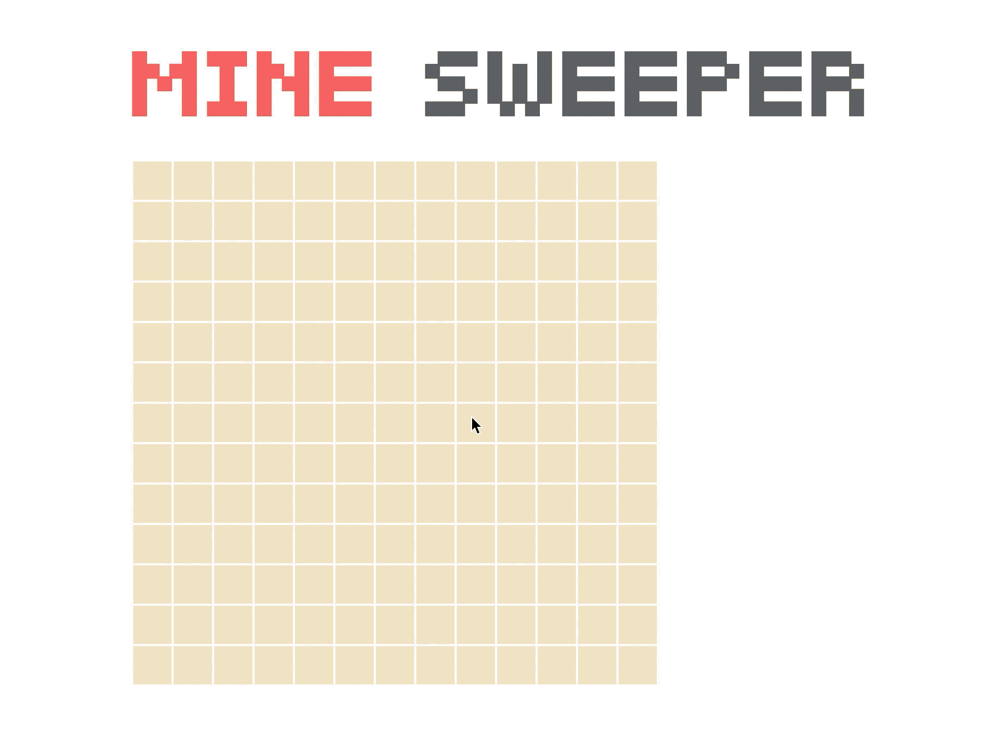

# Mine Sweeper

this is a demo of game *Mine Sweeper* implemented by JavaScript.

# How to run

Directly download or `git pull` this project from github, then run following commands:

```shell
npm install
npm run start
```

then the game will be servered on `http://localhost:8080`.

Now, just click the link and you will see something like this:


Now just have fun!

# How to play

- `LeftClick`: reveal an unrevealed square.
- `RightClick`: mark an unrevealed square as mine.

You can get other information about *Minesweeper* from [Wiki](https://en.wikipedia.org/wiki/Minesweeper_(video_game)).

